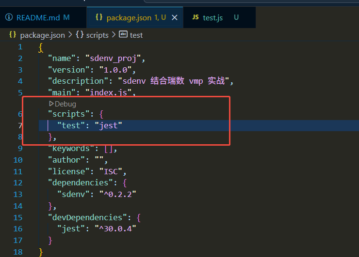
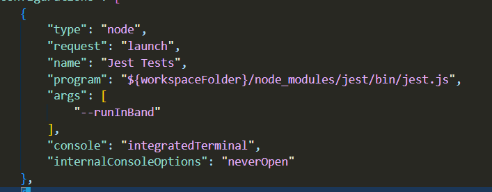
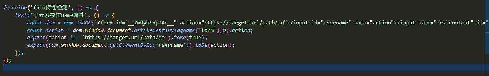

# sdenv_proj
sdenv 结合瑞数 vmp 实战

# 项目环境搭建

1. 绑定 node 版本

    echo "20.11.0" > .nvmrc

2. 初始化项目

    npm init -y

3. 安装 sdenv 插件

    npm i sdenv

4. 安装测试工具

    npm install --save-dev jest

5. 配置 jest 执行

    配置 package.json
    

    配置 launch.json
    

5. 测试

    
